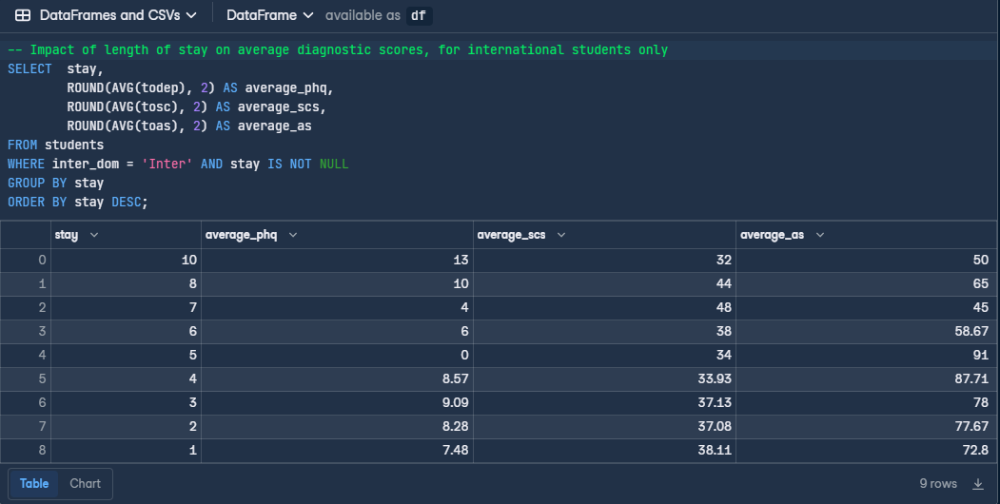

# Analyzing Student's Mental Health in SQL

## Description 
How does attending university in a different country affect mental health ? A Japanese international study in 2018 asked that very question. Publishing a study of the results which were approved by several ethical and regulatory boards.  
The study found that international students have a higher risk of mental health difficulties than the general population, and that social connectedness (belonging to a social group) and acculturative stress (stress associated with joining a new culture) are predictive of depression.
The following guided project from [DataCamp](https://www.datacamp.com/) set out to validate the findings and see if a similar conclusion could be found analyzing the data in ***PostgreSQL***, as well to see if the length of stay for a student was a contributing factor to mental health. 

# Link to Study
[Depression, Acculturative Stress, and Social Connectedness among International University Students in Japan: A Statistical Investigation](https://www.mdpi.com/2071-1050/11/3/878)

## Overview & Aim
To verify the findings of the Japanese study through my own exploratory analysis in SQL, and to measure how much of a contributing factor the "length of stay" variable was towards a students' mental health.

## Analysis & Findings 
Based on the results of the final query (seen below), I can see that there is a direct correlation between length of stay for a student and all 3 of the average mental health test scores. As length of stay increases, the `average_phq` score which indicates the average of all PHQ-9 tests (measuring depression) increases. Indicating higher rates of depression the longer a student is away. As well the `average_scs` score (measuring social connectedness) decreases as length of stay increases indicating students having a difficult time developing social relationships in their new country over time.  
Contrarily, the `average_as` score (measuring acculturative stress) decreases as length of stay  increases, which indicates to me that international students do grow more comfortable in their new country and adjust to the culture change as time goes on. A logical finding as we as people tend to (not always) acclamate to our surroundings over time as things like daily routine, societal/social interactions and environment become more familiar, to name a few examples. 

## Technology 

* Jupyter Notebook
* Psygopg2 (PostgreSQL adpater for Python)
* Environment - Python 3.8.10

## Usage

Since the following project is a guided project offered by a paid subscription website, the backend database, connection, user interface & RDMS tool are all hosted on the [DataCamp](https://www.datacamp.com/) website. The corresponding jupyter notebook file cannot be run successfully on it's own as it is not connected to the database in this repository. It is for viewing purposes only.

## License & Ownership

All material and copyrights are property of [DataCamp](https://www.datacamp.com/). Any use of their material is subject to their terms and conditions of service. Access the link to learn more. 